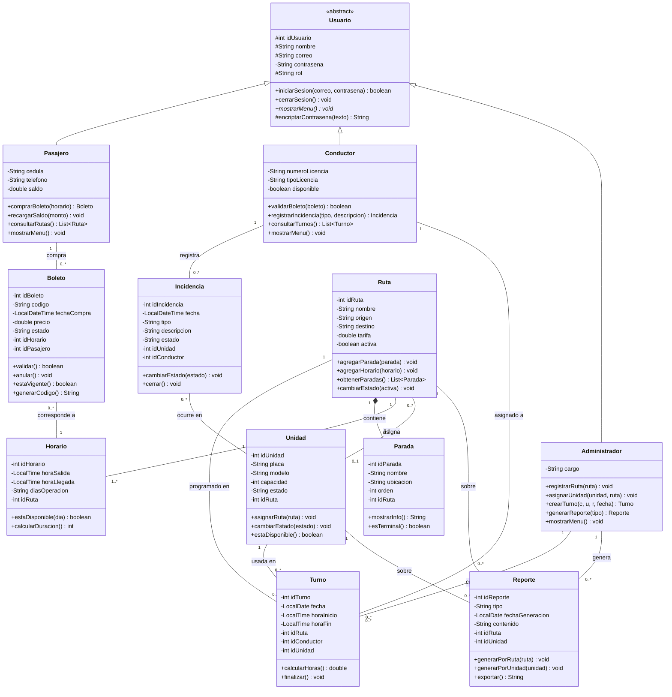

# Sistema de Gestión de Transporte Público

Proyecto Semestral — Programación I
Universidad Tecnológica de Panamá — Facultad de Ingeniería de Sistemas Computacionales
Prof. Víctor Sánchez

Integrantes: Eric De León, Jorge Piñ, Carlos Barría, Ángel Díaz.

Administra rutas, unidades, conductores, horarios, boletos y reportes.

## Estructura del proyecto

Organización **por dominio**: cada concepto del negocio vive en su propio paquete
con sus clases, en lugar de agrupar todo en una sola carpeta `domain`.

```
semestral-programacion1/
├── src/
│   ├── main/
│   │   ├── app/
│   │   │   └── Main.java
│   │   ├── usuario/      # Usuario, Pasajero, Conductor, Administrador
│   │   │   ├── Usuario.java
│   │   │   ├── Pasajero.java
│   │   │   ├── Conductor.java
│   │   │   └── Administrador.java
│   │   ├── ruta/         # Ruta, Parada, Horario
│   │   │   ├── Ruta.java
│   │   │   ├── Parada.java
│   │   │   └── Horario.java
│   │   ├── boleto/
│   │   │   └── Boleto.java
│   │   ├── turno/
│   │   │   └── Turno.java
│   │   ├── unidad/
│   │   │   └── Unidad.java
│   │   ├── incidencia/
│   │   │   └── Incidencia.java
│   │   ├── reporte/
│   │   │   └── Reporte.java
│   │   └── utils/
│   │       └── Validador.java
│   └── test/
│       └── PruebasSistema.java
├── docs/
│   └── uml/
│       └── diagrama-clases.puml          # Diagrama de clases (PlantUML)
└── README.md
```

Paquetes simples por dominio: `app`, `usuario`, `ruta`, `boleto`, `turno`, `unidad`, `incidencia`, `reporte`, `utils`.

## Compilar y ejecutar

```powershell
$files = Get-ChildItem -Recurse -Filter *.java -Path "src\main"
javac -d out $files
java -cp out app.Main
```

## Ejecutar las pruebas

Sin dependencias externas: es un runner plano que imprime `[OK]`/`[FALLO]`.

```powershell
$files = @()
$files += Get-ChildItem -Recurse -Filter *.java -Path "src\main" | Select-Object -ExpandProperty FullName
$files += Get-ChildItem -Recurse -Filter *.java -Path "src\test" | Select-Object -ExpandProperty FullName
javac -d out $files
java -cp out PruebasSistema
```

## Diagrama de clases

Fuente editable en [`docs/uml/diagrama-clases.puml`](docs/uml/diagrama-clases.puml).

Visor interactivo del diagrama (HTML + Tailwind + SVG, permite zoom, filtros por
paquete, buscador e inspector de clases): repositorio
[`semestral-programacion1UML`](https://github.com/Jorge-Dev27/semestral-programacion1UML)
(abrir `index.html`).



## Cómo renderizar el diagrama

- PlantUML (VS Code: extensión *PlantUML*), o
- CLI: `plantuml docs/uml/diagrama-clases.puml -tpng`, o
- En línea: <https://www.plantuml.com/plantuml>.

El diagrama Mermaid de este README se previsualiza directamente en GitHub.

## Escenarios cubiertos

- Asignación de rutas y horarios (`Ruta`–`Horario`–`Turno`).
- Venta y validación de boletos (`Pasajero.comprarBoleto`, `Conductor.validarBoleto`).
- Registro de incidencias (`Conductor.registrarIncidencia`, `Incidencia`–`Unidad`).
- Reportes por ruta y unidad (`Reporte`–`Ruta` / `Reporte`–`Unidad`).
- Asignación de unidades y control de turnos (`Administrador.crearTurno`, `Unidad`–`Ruta`).
- Acceso por rol (`Usuario.rol` + `mostrarMenu()`).

## Correcciones aplicadas al diagrama

1. Se agregó la asociación `Turno`–`Ruta` y se integró `Turno` con `Conductor`, `Unidad` y `Ruta`.
2. Se corrigieron las multiplicidades de `Turno`–`Unidad`, `Conductor`–`Turno`, `Ruta`–`Unidad` y `Reporte`.
3. Se agregaron las claves foráneas (`idHorario`, `idPasajero`, `idRuta`, `idUnidad`, `idConductor`).
4. Se unificó la nomenclatura (`contrasena` / `encriptarContrasena`) y los tipos primitivos (`boolean`).
5. Se marcó `mostrarMenu()` como `{abstract}` en `Usuario`.
6. `Incidencia` ahora ocurre en una `Unidad` (antes asociada a `Ruta`).
